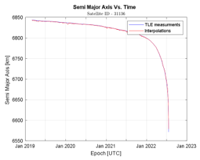
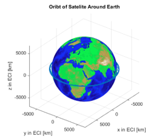
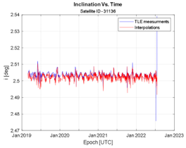
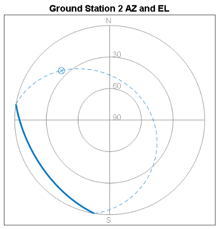
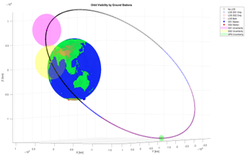
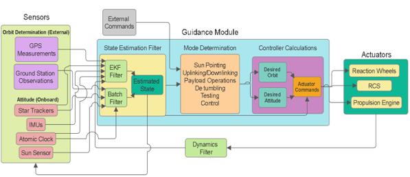
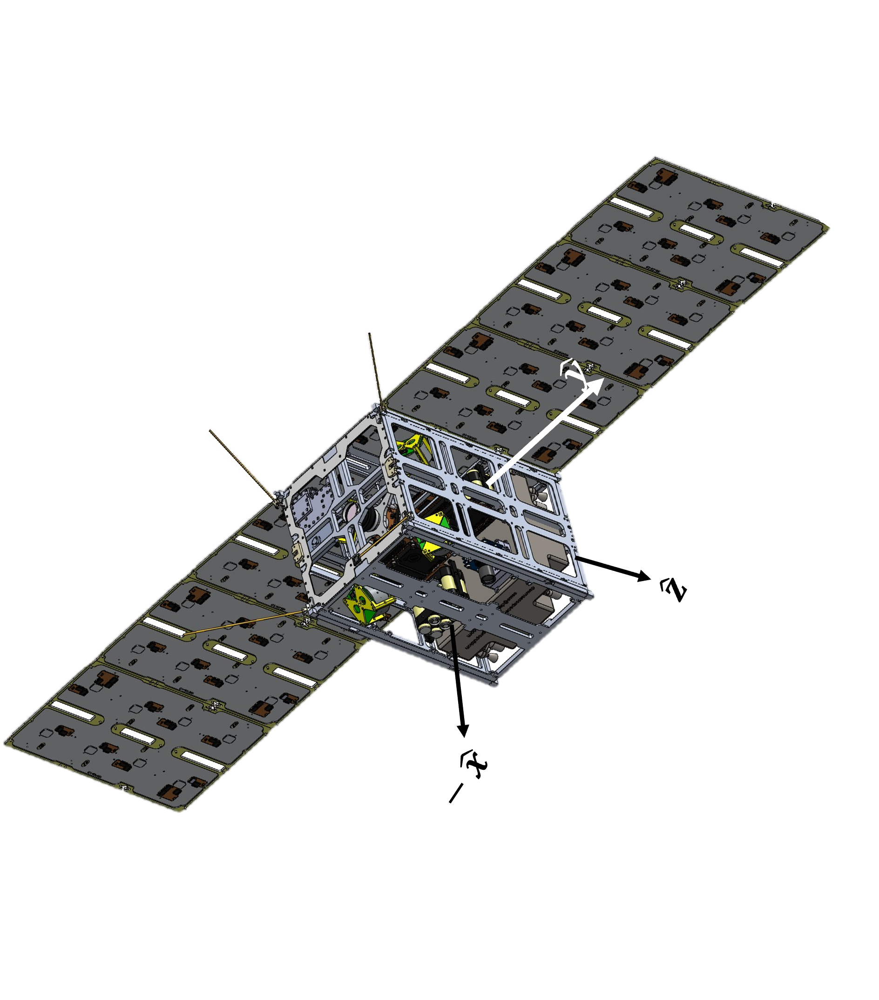
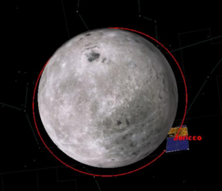
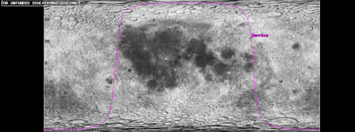
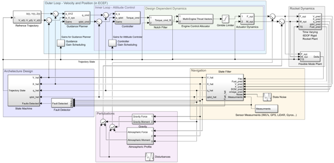

# Flyboy1823.github.io

A few GNC projects I’ve worked on:

---

## Project 1: [TLE Unmodeled Perturbations Project](https://github.com/Flyboy1823/TLE-ME-Thesis-Project)

**Description:**  
*Nation-states with space capabilities are deemed a threat to their enemies, and so knowing where their satellites are and what changes they are making to their orbits is crucial for national security concerns.  This research project aims to aid in these efforts.  By creating an algorithm of downloading TLE information, propagating the satellites and filtering out their intended positions, changes to a satellite’s orbit over time could be plotted and observed, which is the goal of this project.  The idea is to create an algorithm that would flag potential unmodelled changes of satellites’ orbits over time, so that future research could be progressed as well as technologies that make use of this information.*

  
  
  

---

## Project 2: [Assessment of Varying Filters Using Uncertain Navigational Data](https://github.com/Flyboy1823/Satellite-Navigation-from-Multiple-Measurement-Methods)

**Description:**  
*This project assess methods of determining satellite position and velocity (orbit determination) for cis-lunar orbits.  The project focuses on two estimation methods, namely batch estimation and sequential filtering, and discusses the reliability of propagation with uncertainty.*

  
  
  

---

## Project 3: [Attitude Control for Restrictive Thrusters](https://github.com/Flyboy1823/Attitude-Control-With-Restrictive-Thrusters)

**Description:**  
*For deep space missions, total added impulse in an inertial frame might be the reference signal inputted.  With thrusters that have min and max on and off times, a robust control method must be designed.  This controller includes SMC and Bang-Bang with deadband control for angular velocity and attitude as well as PFPW Modulations.  Monte Carlo simulations were used to determine the effects of perturbations on the attitude of the spacecraft.*

<table align="center">
  <tr>
    <td width="60%">
       
      
    </td>
    <td width="40%" align="center">
      
    </td>
  </tr>
</table>

---

## Project 4: [Student Designed Lunar Orbital CubeSat – JERICCO](https://github.com/Flyboy1823/JERICCO/tree/main)

**Description:**  
*JERICCO was a collaboration between Technion Institute of Technology and IAI to build a student design lunar CubeSat.  As Missions and Orbit team lead, I designed the orbital simulation apparatus using GMAT and STK, calculated the fuel budget for a 5-year mission around the lunar surface, and determined necessary vectors over time for orbital corrections, sun pointing and Earth-bound communications.*

  
  
  

---

## Project 5: [GNC System Design CONOPS for Thrust Vector Controlled Launcher](https://github.com/Flyboy1823/TVC-GNC-System-Design)

**Description:**  
*This project is designed to develop the high-level conceptual design process of a developing the GNC system for a launcher using thrust vector control.  The idea is to understand the dynamics involved, the methodology of the state machine and the necessary block diagram for the system.  A full Concept of Operations was written to describe in detail the reasoning behind each block.*

  

---

## Project 6: [Deep Space Navigation Tool – Concept of Operations](https://github.com/Flyboy1823/GEO-VBLI)

**Description:**  
*A PHD research project that designed a system of navigation for deep space vehicles using VBLI principles.  Rather than using Earth based ground stations as geometric points for a VBLI triangulation, GEO satellites would allow for increased accuracy for spacecrafts that are deeper in space.  This project designed the concept of operations for this navigational system.  I wrote the DCM tranformation matricies for refrence frames between the spacecraft, the GEO satellites, and the ground stations.  Furthermore, the calculations that involved reletavistic physics converting signal time between spacecrafts in deep space and Earth time refrence frame.*

